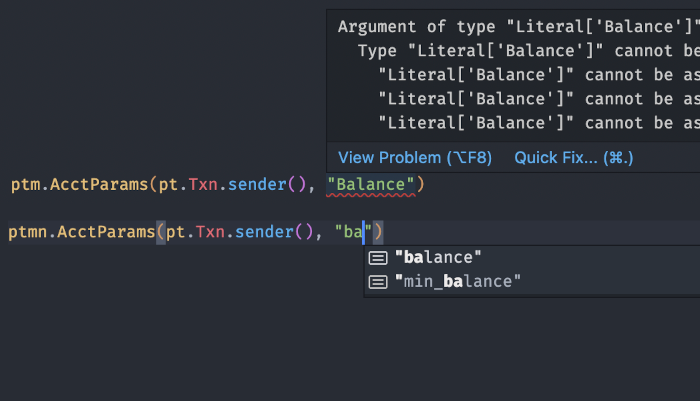

# PyTeal MaybeNot extension

## Security

None of the code in the repository has been audited and no security guarantees are provided - any
use is _ENTIRELY_ at own responsibility!

## Installation

The package can be installed via `pip`

```sh
pip install git+https://github.com/prismaticfi/pyteal-maybenot.git
```

or `poetry`

```sh
poetry add git+https://github.com/prismaticfi/pyteal-maybenot.git
```

## Summary

`PyTeal MaybeNot` provides a set of custom `Expr` subclasses to replace the `MaybeValue` classes
provided natively in `PyTeal` to deal with reading external state, such as global- and local state
of other contracts, asset parameters, account information and so on. The extension provides slightly
better performance, smaller bytecode footprints, and most importantly, a (hopefully!) more
convenient and readable syntax than the native equivalents.

External state can be read via `exists()` and `get()` method calls on instances of `ExAppGlobal`,
`ExAppLocal` `AcctParams`, `AppParams`, `AssetHolding` and `AssetParams` classes. For example:

```python
import pyteal as pt
import pyteal_maybenot as ptmn

# example transaction checks
pt.Seq(
    ...,
    pt.Assert(
        pt.Txn.sender() == ptmn.ExAppGlobal(pt.Txn.applications[1], pt.Bytes("admin")).get(),
        pt.Txn.sender() == ptmn.AppParams(pt.Txn.applications[1], "creator").get(),
        pt.Txn.sender() == ptmn.AssetParams(pt.Txn.assets[0], "reserve").get(),
        ptmn.ExAppLocal(pt.Txn.sender(), pt.Txn.applications[2], pt.Bytes("key")).exists(),
    ),
    ...
)

# txn Sender            -> [ ..., sender]
# txna Applications 1   -> [ ..., sender, Application 1]
# byte "admin"          -> [ ..., sender, Application 1, "admin"]
# app_global_get_ex     -> [..., sender, value, value exists?]
# assert                -> assert exists -> [..., sender, value]
# ==                    -> [ ..., sender == value?]
# assert                -> assert sender == value -> [ ... ]
# txn Sender
# txna Applications 1
# app_params_get AppCreator
# assert
# ==
# assert
# txn Sender
# txna Assets 0
# asset_params_get AssetReserve
# assert
# ==
# assert
# txn Sender
# txna Applications 2
# byte "key"
# app_local_get_ex
# swap
# store 0
# assert
```

Type checking ensures that invalid references to fields are caught early.



## Differences from native `MaybeValue`

Reading external state pushes two values onto the stack (a flag denoting existence and another
value representing the state, or `int 0` if it does not exist) - since `PyTeal` generally avoids
exposing direct stack manipulation, these cases are by default handled through storing both values
in scratch storage, then loading them back upon calling `hasValue()` and `value()`.

For branching on the exists condition this is generally fine, but in many practical cases, the only
requirement is to assert that the value exists (if at all). In this case, the `MaybeValue`
implementation wastes operations on storing and loading values that could simply be accessed
immediately.

An (arguably) bigger cause for opinion is the syntax. In order to read the desired value, a
reference to the `MaybeValue` instance must precede the value access itself, e.g.:

```python
pt.Seq(
    (myStatus := pt.App.globalGetEx(pt.Txn.applications[0], pt.Bytes("status"))),
    pt.If(myStatus.hasValue(), myStatus.value(), pt.Bytes("none"))
)
```
or one has to utilize the equivalent `outputReducer` method
```python
pt.App.globalGetEx(pt.Txn.applications[0], pt.Bytes("status")).outputReducer(
    lambda value, has_value: pt.If(has_value, value, pt.Bytes("none"))
)
```
which both compile to the following `TEAL` code:
```
txna Applications 0
byte "status"
app_global_get_ex
store 1
store 0
load 1
bnz main_l2
byte "none"
b main_l3
main_l2:
load 0
main_l3:
return
```

While syntax is entirely subjective, these calling conventions may not feel especially natural or
readable to beginners.

The `Expr` classes provided here instead handles the stack directly within `TEAL` blocks, but does
so conditionally (explained further below). External state access can be in-lined without storage,
and existence is asserted by default, e.g.:

```python
pt.Seq(
    ...,
    ptmn.ExAppGlobal(pt.Txn.applications[0], pt.Bytes("status")).get(),
    ...,
)

# txna Applications 0
# byte "status"
# app_global_get_ex
# assert

# stack == [..., value]
```
leads to the same stack (ignoring scratch storage) as
```python
myStatus = pt.App.globalGetEx(pt.Txn.applications[0], pt.Bytes("status"))

pt.Seq(
    ...,
    myStatus,
    pt.Assert(myStatus.hasValue()),
    myStatus.value(),
    ...,
)

# txna Applications 0
# byte "status"
# app_global_get_ex
# store 1
# store 0
# load 1
# assert
# load 0

# stack == [..., value]
```

When branching on the existence flag, the value is cached by default, which triggers the `get` call
to automatically load the cached value instead of repeating the steps to retrieve the original
value:
```python
status = ptmn.ExAppGlobal(pt.Txn.applications[0], pt.Bytes("status"))

pt.If(status.exists(), status.get(), pt.Bytes("none"))

# txna Applications 0
# byte "status"
# app_global_get_ex
# swap
# store 0
# bnz main_l2
# byte "none"
# b main_l3
# main_l2:
# load 0
# main_l3:
# return
```
Storing can be opted out of by passing `store=False` in the `exists()` call, which replaces the
`store` operation with `pop`. Similarly, asserting existence- and loading the cached value can be
disabled by passing `assert_has_value=False` and `load=False` respectively in the `get()` call.
